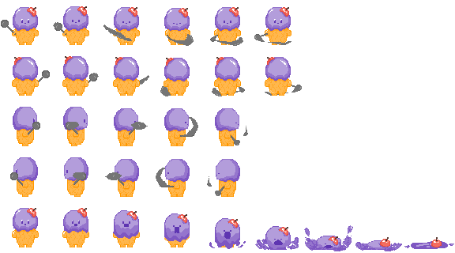

# Proyecto Food Mayhem
### Cambio de nombre propuesto -> I-Scream 

## Game Design Document

__Juegos en Red
Curso 2022/23__

## Vídeo demo técnico
https://youtu.be/xZE7valpch4

__Fase 1__

> Integrantes del grupo: 
> - Nerea Díaz Jérica
> - Rosa Suffo García
> - Adriana Sanchez Illán
> - Santiago Meneses Gómez

## Índice

Introducción
- Concepto del juego
- Características principales
- Género
- Propósito y público objetivo
- Plataformas
- Jugabilidad
- Estilo visual

Mecánicas del juego
- Jugabilidad
- Flujo del juego
- Personajes
- Protagonistas
- Objetos
- Movimiento y físicas
- Interacción entre elementos
- Controles

Interfaz 
- Diagrama de flujo
- Menú principal
- Créditos
- (Selección de perfil)
- (Selección de nivel)
- (Selección de habilidades)
- Nivel
- Fin de nivel

Arte 

El modo principal implementado ha sido el __Modo Arcade__. Varios tipos de enemigos se generan en pantalla y buscan a los enemigos hasta matarlos. Los jugadores pueden utilizar ataques normales y a distancia para ir eliminándolos uno a uno.

## 1.   Introducción

  Este es el documento de diseño de Food Mayhem, un videojuego de mazmorras para PC tanto competitivo como cooperativo, en el que unos sabrosos pero fieros protagonistas se enfrentan a hordas de gigantes exquisiteces. Este escrito tiene como objetivo principal plasmar los elementos que debe incluir Food Mayhem y servir como carta de presentación del juego.

### 1.1.   Concepto del juego

 Food Mayhem es un videojuego en el que los jugadores deben lograr derrotar a las innumerables oleadas de enemigos para poder avanzar de nivel y llegar hasta el final. Para ello se valdrá de distintas armas, poderes u objetos dependiendo del personaje seleccionado y podrá decidir si contar con la ayuda de sus amigos o al contrario, competir contra ellos y ver quién logra eliminar más adversarios.

### 1.2.   Características principales

El juego se basa en los siguientes pilares:

Mecánica sencilla y profunda: se trata de un sistema de juego con normas y reglas sencillas que el jugador reconozca y le permitan adaptarse rápidamente, pero que a la vez ofrece un sinfín de posibilidades de manera que deba demostrar su habilidad y destreza para enfrentarse a los enemigos con éxito.
Rejugabilidad: el desarrollo de este juego dicta un aumento del reto que satisface la necesidad de autosuperación del jugador debido a la oportunidad de mejorar eliminando enemigos de forma más rápida, y además, el hecho de incluir distintos modos de juego en los que competir con o en contra de tus amigos le abre todo un abanico de posibilidades.
Ampliación: Food Mayhem, al no tener una narrativa cerrada y contar con un desarrollo de un motor todo lo independiente posible del contenido, podrá ser ampliable a nuevos personajes y escenarios.

### 1.3.   Género

Food Mayhem es un videojuego roguelike, también conocido como juegos de mazmorras o calabozos, que consiste en un subgénero de los videojuegos de rol, caracterizados por una aventura a través de laberintos o niveles en las que el protagonista se enfrenta de forma continua a enemigos para poder avanzar.

### 1.4.   Propósito y público objetivo

 El principal objetivo de Food Mayhem es entretener al usuario con este divertido pero desafiante juego que le permitirá autosuperarse con el fin de derrotar a los enemigos y también disfrutar de las distintas alternativas del modo multijugador para jugar en compañía. Además, su estilo cuidado y detallado pretende lograr una buena inmersión que dé como resultado un lugar en el que el jugador se sienta cómodo y al que quiera regresar.

 En cuanto al público, Food Mayhem está dirigido a jugadores de un amplio rango de edades a los que les gusten los desafíos de batalla, y que dispongan de un tiempo limitado, puesto que el sistema de partidas cortas permite poder jugar de forma espontánea.

### 1.5.   Plataformas

 Food Mayhem estará disponible únicamente para PC.

### 1.6.   Jugabilidad

  Cada nivel de Food Mayhem es un escenario distinto en el que el jugador se enfrenta a una horda de enemigos, y para combatirlos contará con los siguientes elementos:
Movilidad: el jugador controla a un personaje con el que desplazarse por todo el escenario.
Selección de personajes: el jugador contará con distintos personajes entre los que elegir para jugar con él.
Armas, poderes u objetos: dependiendo del personaje que escoja el usuario, este le proporcionará una forma de combatir única, ya sea a distancia con armas de fuego como pistolas o hechizos, o cuerpo a cuerpo con espadas o lanzas.
Objetos: a lo largo y ancho del escenario habrá distribuidos objetos que podrán servir de ayuda para cubrirse o incluso atacar a los enemigos.

### 2.7.   Estilo visual
  Food Mayhem tendrá un estilo sencillo pero detallado y cuidado que pueda ser apreciado por los jugadores para que les ayude a sentirse cómodos e inmersos en el juego. Se trata de un estilo de pixel art muy suave y agradable a la vista con colores vivos acordes con la acción que requiere el juego que creen un ambiente de batalla pero acogedor a la vez, y en cuanto a la temática, consistirá en un mundo de gominolas y dulces en los que todo está hecho de los más deliciosos manjares, incluyendo a los propios personajes, creando así un rogue-like distinto a los que acostumbramos a ver.

## 3.   Mecánicas

En esta sección se describen todas las mecánicas implementadas y la jugabilidad del juego mismo, así como el transcurso de una partida normal, en modo local u online. Se detallan las acciones que pueden realizar los personajes, su interacción con el mundo virtual y una descripción a fondo sobre sus características. 

### 3.1. Jugabilidad

El concepto inicial del videojuego está basado en el género roguelike. Se trata de una aventura en la que los jugadores se enfrentarán a hordas de enemigos, con ya sea poderes, armas u objetos que puedan ir encontrando en el mapa.

El plano de cámara será cenital en la que se podrá observar todo el escenario, el estilo visual será 2D y todos los personajes serán visibles en pantalla, por lo que no sería necesario requerir de una pantalla partida a la hora de jugar multijugador local.

El juego se desarrolla por niveles, los escenarios serán completados una vez todos los enemigos sean derrotados. Cada nivel tendrá un escenario independiente, el cual no será más grande de lo que se pueda observar en pantalla.

En una fase temprana, se han ideado varios modos de juego para variar la experiencia.

Modo Campaña: Modo multijugador cooperativo (Local/ En línea) / Un jugador.  El/Los jugador/es se enzarzan en una aventura por niveles en las que irán derrotando enemigos utilizando los recursos disponibles. Cada cierto número de pantallas se implementará la lucha contra un jefe final.

Modo Versus (Last Man Standing): Modo multijugador competitivo. Los jugadores lucharán entre sí hasta derrotarse. Los combates estarán limitados por tiempo y los jugadores podrán utilizar las características desbloqueadas en el modo campaña para luchar. (Implica un sistema de matchmaking) A su vez, también pueden aparecer enemigos controlados por la IA para incrementar la dificultad del desafío. 

Modo Arcade: Modo multijugador cooperativo / Un jugador. Consiste en oleadas de enemigos que irán incrementando en número y dificultad en cada ronda, se deberá sobrevivir el mayor número de rondas posibles y los jugadores cooperan para sobrevivir, y a su vez, compiten para obtener el mayor número de bajas posibles.

### 3.2. Flujo de juego
_______________________________________________________________________	
 __Update(28/11/22) - FASE 1__
 
 Por el momento, se contempla tan solo el modo Arcade, principalmente. El modo Versus, cambiaría las colisiones entre jugadores permitiendo el fuego amigo. El modo Campaña, será el último en implementar debido a que es el más extenso, e ir ampliando el modo Arcade, permite posteriormente trasladar ese trabajo para realizar un modo Campaña.
 ##### Cambios
	 No hay cambios contemplados.

_______________________________________________________________________

En el menú de selección de personaje, antes de iniciar la partida, el jugador podrá escoger el personaje con el que quiere jugar, ponerle nombre y comenzar a jugar.

- Flujo de Modo Campaña. El modo campaña se desarrolla por niveles, los jugadores comenzarán en el nivel inicial, partiendo con estadísticas base y armas iniciales. Se irán enfrentando a varios enemigos, subiendo de nivel y mejorando su arsenal. Todas las armas recogidas y mejoras serán guardadas entre niveles y partidas. Cada cierto número de niveles con enemigos básicos, el jugador / los jugadores se enfrentará/n a un jefe final que marca el final de la sección de niveles. A partir de ahí, la mecánica se repite una y otra vez, avanzando con enemigos más complicados, armas más poderosas y jefes más fuertes.

- Flujo de Modo Versus. En el modo versus, dos jugadores (posibilidad de añadir más) se enfrentan uno contra el otro cada uno con un personaje de su elección. En medio de la batalla, aparecerán armas y enemigos que complicarán la batalla. El modo se reproduce en asaltos y el ganador es aquel que gane el mejor de 3. 

- Flujo de Modo Arcade. En el modo arcade, dos jugadores, pueden cooperar para superar y sobrevivir oleadas de enemigos que irán progresando en dificultad conforme avancen los jugadores. A su vez, los jugadores también compiten entre sí para tener la mejor puntuación de bajas de enemigos. En el modo arcade, pueden aparecer jefes finales.

### 3.3. Personajes
_______________________________________________________________________	
 __Update(28/11/22) - FASE 1__
 
 Por el momento, hay dos jugadores permitidos, sin embargo utilizan el mismo personaje, la selección de más de un personaje con distintos atributos todavía no está implementada. Los enemigos por el contrario, tienen su propio daño, movimiento y velocidad de ataque, por lo cual se diferencian entre sí en tema de atributos.
 
 ##### Cambios
	 Ataques. Para cada personaje está contemplado que su ataque a distancia sea distinto, al igual que su animación de ataque físico será única. Los ataques especiales también deben ser únicos de los personajes.
	
	Idea de personaje: Helado Carrión, los ataques a distancia son un choque de ondas en un área alrededor.

_______________________________________________________________________

Los personajes seleccionables tendrán una serie de características que podrán ir mejorando a medida que suban de nivel. Cada personaje tendrá una serie de habilidades y funciones únicas que podrán complementarse con armas y objetos que se vayan recogiendo. 

La lista de atributos que podrán ir mejorando será: 

- Vida. Aumenta la vida máxima del personaje.
- Resistencia. Controla el número de evasiones que podemos realizar antes de quedarnos sin estamina.
- Fuerza. Atributo que mejora el daño que se realiza con las armas.
- Magia. Atributo que mejora el daño realizado con las habilidades de daño mágico.
- Precisión. Disminuye la dispersión de las armas a distancia y aumenta la probabilidad de daño crítico.
- Manejo. Controla la destreza del personaje para portar distintas armas.

### 3.4. Objetos
_______________________________________________________________________	
 __Update(28/11/22) - FASE 1__
 
 Se han implementado una espada y una varita. La espada altera el daño cuerpo a cuerpo y la varita aumenta el daño a distancia.
 ##### Cambios
	 No hay cambios contemplados.

_______________________________________________________________________
Habrá una cantidad diversa de objetos de dos categorías distintas: consumibles y armas. Las armas pueden tener distintas características, distintos tipos de ataque y requerir de ciertos atributos para poder usarse.
Los consumibles pueden incluir pociones para curarse, armas arrojadizas, etc.

### 3.5. Movimiento y físicas

#### 3.5.1. Interacción entre elementos
_______________________________________________________________________	
 __Update(28/11/22) - FASE 1__
 
 ##### Cambios
	 No hay colisiones entre personajes de movimiento. Un jugador se puede superponer sobre otro, pero las colisiones para recibir daños entre sí, sí están contempladas.

_______________________________________________________________________

- Personajes principales - Enemigos. Colisiones entre enemigos y PJs para ataques. - __DONE__
- Personaje - Personaje. Colisiones entre PJs para ataques.
- Personaje - Objetos. Colisiones para recoger objetos. 
- Proyectiles - Enemigos. Colisiones para recibir daños. - __DONE__
- Proyectiles - Personajes. Colisiones para recibir daños.
- Personajes - NPCs - Mundo virtual. Colisiones para saber cual es el terreno caminable. - __DONE__

#### 3.5.2. Controles
_______________________________________________________________________	
 __Update(28/11/22) - FASE 1__
 
 Los controles de moverse, ataque físico y abrir inventario están implementadas. Los ataques especiales están ideados y la implementación, una vez bien pulido los ataques físicos, debería ser sencilla.
 
 ##### Cambios
	 Ataques a distancia. ¡Los personajes pueden atacar a distancia con sus bolas de helado sin necesidad de llevar armas! El daño a distancia es algo menor que el daño físico.
	 
	Movimiento. Los controles estaban ideados para ser teclado y ratón para el P1 y mando para el P2. Se va a realizar un cambio para que con solo un teclado dos jugadores puedan jugar.

_______________________________________________________________________	
 
- Moverse - __DONE__
- Esquivar
- Ataque físico - __DONE__
- Ataques especiales
- Usar objeto
- Arrojar objeto
- Recoger objeto
- Abrir inventario - __DONE__
- Recargar armas/magia

## 4. Interfaz
En esta sección se describe detalladamente cada una de las pantallas que componen Food Mayhem, junto con sus transiciones y la utilidad de cada elemento de la GUI. Se adjuntan a continuación bocetos que marcan las partes de cada pantalla que tendrá el juego. Son, como antes dicho, simples ideas de lo que más adelante los artistas desarrollarán, aplicando el estilo y la estética definidas.

### 4.1. Diagrama de flujo
A continuación se muestran las pantallas del Nombre y las transiciones entre ellas.

### 4.2. Menú Principal

_______________________________________________________________________	
 __Update(28/11/22) - FASE 1__
 
 La pantalla de Inicio no tiene todos los elementos desarrollados por el momento.
 
 ##### Cambios
	 Se ha añadido una pantalla de carga.
_______________________________________________________________________	
#### Pantalla Carga

#### Pantalla Inicio

Lista de los elementos:
- Logo del juego
- Botón Partida Local: lleva a la selección de skin de un jugador
- Botón Partida Multijugador: lleva a la selección de skin de dos jugadores y el modo de juego
- Botón: Tutorial: Lleva a la pantalla del tutorial
- Botón Salir: para salir del juego
- Botón Música: para apagar o activar la música del juego

### 4.2. Créditos

Lista de los elementos.
- Panel: texto con los roles de cada miembro del equipo 
- Botón menú: vuelve al menú principal al pulsarse

### 4.3. Un jugador: Selección de skin

Lista de los elementos:
- Lista de skins disponibles, pulsando izquierda o derecha se cambia de uno a otro.
- Texto Player 1: indica el jugador que tendrá el skin seleccionado
- Botón Aceptar: Selecciona el skin en el centro de la lista
- Botón Tutorial: Lleva a la pantalla de Tutorial
- Botón Menú: Lleva al menú principal

#### 4.3.1. Dos jugadores: Selección de skin y modo de juego

Lista de los elementos:
- Listas de skins disponibles, pulsando izquierda o derecha se cambia de uno a otro. Si un jugador tiene seleccionado un skin, el otro no podrá elegir el mismo.
- Textos Player 1 y 2: distinguen los jugadores que tienen cada skin.
- Botones Aceptar: Selecciona el skin en el centro de la lista
- Textos Modo de Juego: para distinguir que en la parte de abajo se selecciona la manera en la que se va a jugar
- Botones Campaña, Versus, Arcade: Se selecciona uno de los tres como modo de juego
- Botón Tutorial: Lleva a la pantalla de tutorial
- Botón de Menú: Lleva al menú principal

### 4.4. Tutorial

Lista de los elementos:
- Panel Reglas: donde se explican los controles y las reglas del juego
- Botón Aceptar: vuelve a la pantalla anterior

### 4.5.  Nivel

Lista de los elementos:
- Escenario: donde se desarrolla toda la acción en el nivel
- Zona izquierda y derecha diferencian entre el jugador 1 y el 2, respectivamente. Para cada uno se dispone de los mismos botones e iconos, por lo que se explicarán los elemento solo del jugador 1 (izquierda) y se asumirá lo mismo para el 2.
- Imagen superior con la cabeza del skin seleccionado por el jugador, junto con su barra de vida. Señala a qué jugador pertenece esa parte del interfaz y la vida que le queda. Conforme aumente la capacidad de vida, la barra se hará más grande.
- Elementos del inventario, distinguidos por el icono de la mochila. La fila será tan larga como objetos haya, con un máximo de 5. Una vez recogidos del escenario, se almacenan aquí. Se podrá clicar encima de cada uno, y dependiendo del tipo de objeto que sea, dará la opción de equiparlo, usarlo, soltarlo, etc.
- Elementos del equipo, distinguidos por el icono del casco.  La fila será tan larga como objetos haya, con un máximo de 3. Se equipan desde el inventario, y en cualquier momento se puede clicar sobre ellos y soltarlos o llevarlos de nuevo al inventario. Solo para elementos como armaduras o armas.
- Botón Más (...) : para ver con más detalle las habilidades de los jugadores, como van progresando, y las características de los objetos que poseen tanto en el inventario como en el equipo. Cuando se clique sobre este, lleva a un menú de pausa a ambos jugadores, por lo que deberán de estar de acuerdo en seleccionarlo.
En el caso de un solo jugador, el interfaz sería el mismo pero manteniendo solo los iconos de la izquierda.

#### 4.5.2. Pausa

Lista de los elementos:
- Dos zonas diferenciadas con los mismos componentes. La izquierda para el jugador 1, y la derecha para el jugador 2. Se explicará sólo la izquierda.
- Icono de la skin seleccionada por el jugador, junto con su nombre al lado. Diferencia la zona de la del otro jugador.
- Barras de habilidades. Todas señalan como han mejorado con respecto a su estado inicial, pero solo la de vida indica también cuando de esa barra se ha consumido. El resto no lo señalan porque no se consumen.
- Descripción de los objetos del inventario, primera línea. La fila de un máximo de 5 elementos, lista los objetos y sus características.
- Descripción del equipo, segunda línea. La fila de un máximo de 3 elementos, lista cada elemento equipado y sus características.
- Botón volver (X): para salir de la pantalla de pausa y seguir jugando.
- Botón menú: para salir al menú principal y dejar la partida. Se pierde todo el progreso.
- Botón tutorial: Lleva a la pantalla de tutorial.

### 4.6. Derrota. Fin de nivel.

Lista de los elementos:
- Botón Menú: Lleva al menú principal
- Botón Repetir Nivel: Solo repite el nivel que se ha perdido
- Botón Salir: Sale del juego.

### 4.7. Victoria Arcade y Campaña. Fin de partida.

Lista de elementos:
- Botón Menú: Lleva al menú principal
- Botón Salir: Sale del juego.

#### 4.7.1. Victoria Versus. Fin de partida.

Lista de los elementos:
- Texto de puntuaciones: indica la experiencia que ha conseguido cada jugador matando solo las hordas de  enemigos, no al jugador contrincante.
- Botón Menú: Lleva al menú principal
- Botón Salir: Sale del juego.

## 5. Arte
_______________________________________________________________________	
 __Update(28/11/22) - FASE 1__

Se ha desarrollado arte propio para nuestro videojuego.

#### Icy
##### Caminar
.png)
##### Atacar y Morir

#### Malvin
##### Caminar
)
##### Atacar y Morir

A su vez también se ha utilizado arte ajeno para realizar nuestro videojuego.
#### Demon

#### Escenario
Para el escenario se ha utilizado un tileset descargado de it.chio (creado por: Cup Nooble), y se ha usado el programa Tiled para crear el mapa.

_______________________________________________________________________

API REST

Se ha creado un back-end que permite implementar la comunicación entre el cliente y un servidor utilizando un servicio REST, definir la API REST que ofrecerá el servidor y definir las funciones de gestión de clientes y servidor, así como los datos que se gestionarán usando REST. En nuestro caso se ha utilizado REST para la implementación del login del los usuarios al inicio del juego, para almacenar su nombre y contraseña. También se ha usado para guardar las mejores puntaciones de cada usuario, y mantener actualizada la lista de highscores del juego.

WEBSOCKETS

Se utilizan WebSockets como mecanismo de comunicación asíncrona en el juego. Se han creado 8 clases para los WebSocket por ejemplo, para el chat, el movimiento de los enemigos, la información de cada jugador. A continuación se enumeran todas las clases implementadas:
- ChatWebSocket.js
- ConnectionsWebSocket.js
- EnemyMovementWebSocket.js
- GenerationWebSocket.js
- MovementWebSocket.js
- PlayerInfoWebSocket.js
- SceneChangeWebSocket.js
- WebSocketVariables.js
  

DIAGRAMA DE CLASES

